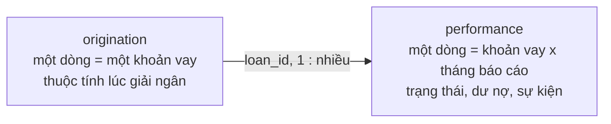

# Chất lượng dữ liệu — Freddie Mac Single-Family Loan-Level Dataset (sample)

Tài liệu này tóm tắt cấu trúc, chất lượng và những giới hạn cần lưu ý của bộ dữ liệu
Freddie Mac trước khi dựng panel, portfolio monitoring (Stage 8) và Early Warning System
(Stage 9). Kết quả được lập từ dữ liệu gốc ngày **2026-09-19**.

## 1. Kết luận nhanh

- Pipeline đã nạp **14 lứa giải ngân (2012-2025)**, mỗi lứa 50,000 khoản vay: tổng
  **700,000 khoản** và **35,649,411 dòng** dữ liệu tháng, từ 2012-01 đến **2026-03**.
  3.9 GB text thành 318 MB parquet trong 81 giây.
- Validation đạt **111 checks, 0 errors, 0 warnings**. File layout July 2026 được xác
  nhận bằng dữ liệu (xem mục 2.3).
- Panel rất sạch: tháng liên tục (trừ 3 khoản), mỗi khoản có tối đa một dòng zero balance
  và không có dòng nào sau đó.
- EWS là bài toán **sự kiện cực hiếm**: tỷ lệ chạm 90+ DPD trong 3 tháng khoảng **0.12%**
  ở giai đoạn train và **0.25%** ở out-of-time, thấp hơn nhiều mức 0.5-2% thường gặp.
- COVID được xác nhận bằng số liệu: tỷ lệ dòng 90+ tăng từ khoảng 0.3% lên **1.7-2.0%**
  trong 2020-2021.
- Trả trước chiếm áp đảo (71-82% khoản của lứa 2012-2019), trong khi thanh lý dưới 1%:
  prepayment là competing risk chính.

## 2. Cách đọc mô hình dữ liệu

### 2.1. Hai bảng và một định danh



`loan_id` có dạng `PYYQnXXXXXXX`: `P` là sản phẩm (`F` lãi suất cố định, `A` ARM),
`YY` là năm giải ngân, `Qn` là quý giải ngân. Ví dụ `F12Q10000023` là khoản lãi suất cố
định giải ngân quý 1/2012.

**Lứa (vintage) phải lấy từ `loan_id`**, không lấy từ `first_payment_date`: ở mọi lứa,
khoảng 16% khoản vay trả kỳ đầu vào năm sau năm giải ngân.

### 2.2. Quy ước thời gian

- `period`: tháng báo cáo, lưu dưới dạng ngày 01 của tháng.
- `loan_age`: số tháng kể từ khi giải ngân (MOB). **Dùng cột này cho vintage curve**,
  không đếm số dòng: 60,849 khoản (8.7%) xuất hiện lần đầu khi `loan_age > 0`, tức panel
  bị cắt trái (left truncation).
- Dữ liệu tháng kết thúc ở **2026-03**. Nhãn EWS cần t+1..t+3, nên tháng quan sát cuối
  cùng có nhãn đầy đủ là **2025-12**.

### 2.3. Bằng chứng file layout được đọc đúng

File không có header nên chỉ cần lệch một cột là mọi thứ sai theo. Ba cột độc lập khớp
nhau hoàn toàn:

- 100% khoản `harp_indicator = Y` đều có `pre_harp_loan_id`;
- 47,975 / 48,005 khoản thiếu `orig_dti` là HARP (HARP không yêu cầu DTI);
- 12,356 khoản HARP có LTV > 100% (cao nhất 684%), so với chỉ 8 khoản không HARP.

## 3. Danh mục và mô tả từng bảng

| Bảng | Số dòng | Số cột | Một dòng đại diện cho | Khóa |
|---|---:|---:|---|---|
| `origination` | 700,000 | 31 | Một khoản vay tại thời điểm giải ngân | `loan_id` |
| `performance` | 35,649,411 | 35 | Một khoản vay trong một tháng báo cáo | `loan_id` + `period` |

### 3.1. `origination`

Thuộc tính lúc giải ngân: điểm tín dụng, LTV / CLTV, DTI, số tiền, lãi suất, kỳ hạn, mục
đích vay, loại tài sản, kênh bán, địa lý (bang, 3 số đầu mã bưu chính, MSA) và các cờ
chương trình (HARP, super conforming, special eligibility).

| Cột | Miền giá trị trên dữ liệu thật | Ghi chú |
|---|---|---|
| `fico` | 300-848 | 133 khoản thiếu |
| `orig_ltv` / `orig_cltv` | 3-684 / 3-854 | LTV > 100 gần như chỉ ở HARP |
| `orig_dti` | 1-65 | 48,005 thiếu, gần như toàn bộ là HARP |
| `orig_upb` | 10,000-2,300,000 | |
| `orig_interest_rate` | 1.625-9.18 | |
| `orig_loan_term` | 60-366 tháng | |
| `loan_purpose` | P 52.3%, N 28.7%, C 19.0% | P mua nhà, N refinance không rút tiền, C refinance rút tiền |
| `occupancy_status` | P 89.2%, I 7.6%, S 3.3% | |
| `first_time_homebuyer` | Y 21.5% | |

Đặc điểm theo lứa:

| Lứa | HARP | Lãi suất TB | FICO TB |
|---|---:|---:|---:|
| 2012 | 34.8% | 3.76% | 759 |
| 2013 | 28.8% | 3.93% | 750 |
| 2014 | 14.6% | 4.31% | 747 |
| 2015 | 8.0% | 3.97% | 750 |
| 2016 | 5.1% | 3.79% | 749 |
| 2017 | 3.6% | 4.19% | 745 |
| 2018 | 1.0% | 4.74% | 746 |
| 2019 | 0.1% | 4.24% | 749 |
| 2020 | 0% | 3.20% | 758 |
| 2021 | 0% | 2.97% | 751 |
| 2022 | 0% | 5.09% | 744 |
| 2023 | 0% | 6.74% | 750 |
| 2024 | 0% | 6.69% | 752 |
| 2025 | 0% | 6.55% | 757 |

### 3.2. `performance`

Trạng thái hằng tháng: dư nợ, `delinquency_status`, `loan_age`, sửa đổi hợp đồng, hỗ trợ
người vay (forbearance, repayment plan), trả chậm do thiên tai, và sự kiện kết thúc
(`zero_balance_code`) cùng các khoản thu hồi / chi phí khi thanh lý.

`delinquency_status`: `00` current, `01` 30-59 ngày, `02` 60-89 ngày, `03` trở lên là
90+ (số tháng quá hạn, cao nhất quan sát được là 88), `RA` REO acquisition (5,449 dòng),
`XX` không rõ trạng thái (13,627 dòng, đổi thành NULL khi ingest).

`zero_balance_code` (số khoản vay):

| Mã | Nghĩa | Số khoản | Vai trò trong project |
|---|---|---:|---|
| `01` | Trả trước hoặc đáo hạn | 370,597 | Competing event |
| `02` | Third party sale | 482 | Default (liquidation) |
| `03` | Short sale / charge off | 269 | Default (liquidation) |
| `09` | REO disposition | 534 | Default (liquidation) |
| `15` | Bán khoản vay | 233 | Kết cục không quan sát được |
| `16` | Chứng khoán hoá RPL | 966 | Kết cục không quan sát được |
| `96` | Defect | 1,695 | Kết cục không quan sát được |

## 4. Kết quả kiểm định chất lượng

| Hạng mục | Kết quả |
|---|---|
| Ingest | Run `20260918T181823Z-adf64872`; 14 lứa; 81 giây |
| Validation (contract đã siết) | Run `20260918T182746Z-2feae91e` |
| Tổng số checks | 111 |
| Errors | 0 |
| Warnings | 0 |
| Trạng thái | **PASS** |

Contract ở `configs/data_contracts/freddie_mac.yaml`. Báo cáo đầy đủ của mỗi lần chạy nằm
ở `artifacts/<run_id>/data_validation/freddie_mac.md` (không commit lên git).

Rule duy nhất còn ở mức `warn` là miền giá trị của `vantagescore4`: cột này trống ở cả 14
lứa nên rule chưa từng được kiểm trên dữ liệu thật.

## 5. Các vấn đề đã biết của dữ liệu gốc

| Vấn đề | Quy mô | Rủi ro | Cách xử lý |
|---|---:|---|---|
| Hụt tháng trong panel | 3 khoản (`F17Q40045268`, `F15Q30201969`, `F15Q40044673`) | Biến trễ và nhãn tính sai quanh tháng bị hụt | Cohort loại theo `incomplete_performance_window` |
| Mã `XX` (không rõ trạng thái) | 13,627 dòng, chỉ ở 2025-2026 | Không biết khoản có quá hạn không | Cohort loại theo `status_not_available_at_t` |
| Khoản chưa có dòng performance | 5 khoản giải ngân Q4/2025 | Không có | Tự hết khi Freddie cập nhật dữ liệu |
| `remaining_months_to_maturity = -1` | 9 dòng | Không đáng kể | Clip về 0 nếu dùng làm feature |
| `current_upb = 0` khi chưa zero balance | 2 dòng | Không đáng kể | Giữ nguyên; không dùng để suy ra tất toán |

## 6. Hệ quả đối với monitoring và EWS

1. **Lứa lấy từ `loan_id`, MOB lấy từ `loan_age`** (mục 2.1 và 2.2). Với survival
   analysis, khoản xuất hiện muộn phải được xử lý như delayed entry.
2. **HARP là một phân khúc riêng.** Tỷ trọng giảm từ 34.8% (lứa 2012) về 0 (từ 2020).
   Giữ `harp_indicator` làm biến phân khúc; DTI bị thiếu ở nhóm này là do chương trình,
   không phải thiếu ngẫu nhiên.
3. **Không dùng các cột chỉ có dữ liệu từ một thời điểm** cho mô hình train trên
   2014-2018: `property_valuation_method` (từ lứa 2017), `eltv` (từ 2017-04),
   `mi_cancellation_indicator` (từ 2015-01), `vantagescore4` (chưa có). Bỏ các cột hằng
   số: `prepayment_penalty`, `amortization_type`, `interest_only_indicator`.
4. **Prepayment là competing risk chính.** Kết cục của từng lứa tính đến 2026-03:

   | Lứa | Từng 90+ | Trả trước | Thanh lý | Kết cục khác | Còn hoạt động |
   |---|---:|---:|---:|---:|---:|
   | 2012 | 3.43% | 79.5% | 0.68% | 0.71% | 19.1% |
   | 2013 | 3.82% | 77.8% | 0.54% | 0.62% | 21.0% |
   | 2014 | 3.87% | 81.6% | 0.34% | 0.55% | 17.5% |
   | 2015 | 4.10% | 76.4% | 0.24% | 0.32% | 23.0% |
   | 2016 | 4.73% | 71.5% | 0.15% | 0.30% | 28.1% |
   | 2017 | 5.83% | 74.6% | 0.15% | 0.49% | 24.7% |
   | 2018 | 5.42% | 79.7% | 0.11% | 0.39% | 19.8% |
   | 2019 | 5.57% | 71.1% | 0.07% | 0.33% | 28.5% |
   | 2020 | 2.26% | 38.8% | 0.04% | 0.32% | 60.9% |
   | 2021 | 2.01% | 19.2% | 0.03% | 0.26% | 80.5% |
   | 2022 | 3.49% | 19.3% | 0.10% | 0.55% | 80.0% |
   | 2023 | 2.43% | 26.0% | 0.10% | 0.43% | 73.5% |
   | 2024 | 1.23% | 18.4% | 0.02% | 0.39% | 81.2% |
   | 2025 | 0.14% | 7.4% | 0.00% | 0.13% | 92.5% |

   Các lứa có độ dài lịch sử khác nhau (từ 170 tháng xuống 14 tháng), nên **không so
   sánh cột "Từng 90+" giữa các lứa**; so sánh đúng phải ở cùng MOB (vintage curve,
   Stage 8).
5. **COVID tạo ra phần lớn số ca 90+ của các lứa 2016-2019.** Tỷ lệ khoản từng chạm 90+
   *trước 2020-03*: lứa 2016 1.09%, 2017 1.08%, 2018 0.47%, 2019 0.10%, so với 4.7-5.8%
   khi tính cả giai đoạn COVID.

   | Năm | Tỷ lệ dòng 90+ | Số dòng forbearance (`F`) |
   |---|---:|---:|
   | 2014-2019 | 0.17-0.33% | dưới 2,400 / năm |
   | 2020 | 1.74% | 92,005 |
   | 2021 | 1.97% | 55,783 |
   | 2022 | 0.75% | 9,331 |
   | 2023-2025 | 0.48-0.58% | khoảng 6,000 / năm |
   | 2026 (Q1) | 0.63% | 1,742 |

   Quyết định coi 2020-03 → 2021-12 là stress segment (PROJECT_SCOPE, quyết định #3) được
   dữ liệu ủng hộ. Mức 90+ sau COVID vẫn cao hơn trước COVID và đang tăng nhẹ từ 2024.

## 7. Hệ quả đối với thiết kế EWS

Ước tính sơ bộ tỷ lệ sự kiện "lần đầu chạm 90+ hoặc thanh lý trong t+1..t+3", trên các
tháng-khoản vay đang hoạt động và chưa 90+ tại t. Hàm gán nhãn chính thức nằm ở
`credit_risk.ews.labels` và có thể cho con số hơi khác.

| Đoạn (theo `configs/ews.yaml`) | Tháng-khoản vay | Sự kiện | Tỷ lệ |
|---|---:|---:|---:|
| Train 2014-01 → 2018-09 | 10,021,125 | 11,542 | 0.115% |
| Validation 2019-01 → 2019-09 | 2,385,638 | 3,035 | 0.127% |
| Stress 2020-03 → 2021-09 | 4,522,931 | 41,622 | 0.920% |
| Out-of-time 2022-01 → 2025-12 | 13,304,593 | 32,786 | 0.246% |

Hệ quả:

- **PR-AUC phải so với mốc khoảng 0.1%**, không so với 0.5. Lift và capture ở top 5% /
  10% là ngôn ngữ báo cáo chính.
- **Tỷ lệ sự kiện ở out-of-time gấp khoảng 2 lần train**: PD của mô hình gần như chắc
  chắn bị thấp hơn thực tế ở giai đoạn test. Calibration phải được báo cáo riêng cho từng
  đoạn, và có thể cần hiệu chỉnh lại mức PD trung bình.
- Train có khoảng 11.5 nghìn sự kiện: đủ cho logistic baseline và LightGBM, với điều kiện
  split theo thời gian và không để một khoản vay lọt vào cả hai phía.

## 8. Tái lập kết quả

Chạy ingest và validation từ thư mục gốc của dự án:

```bash
python -m credit_risk run --steps ingest validate-data --source freddie_mac
```

Kết quả chi tiết của mỗi lần chạy được lưu tại
`artifacts/<run_id>/data_validation/freddie_mac.md`.
