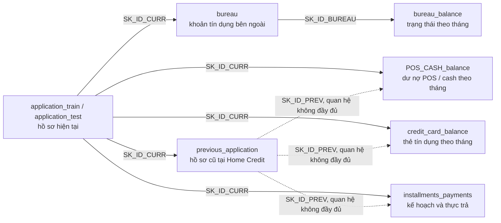

# Chất lượng dữ liệu — Home Credit Default Risk

Tài liệu này giúp đội dự án hiểu dữ liệu Home Credit trước khi tạo feature, binning và
đánh giá độ ổn định bằng PSI. Nội dung tập trung vào cấu trúc bảng, các bất thường có thể
ảnh hưởng đến mô hình, và cách xử lý đã thống nhất; không chỉ là kết quả kiểm tra kỹ thuật.
Kết quả được lập từ dữ liệu gốc
ngày **2026-09-18**.

> **Cách đọc nhanh:** `SK_ID_CURR` là khóa cấp hồ sơ hiện tại và là đường an toàn để tổng hợp lịch sử.
> “Leakage” là thông tin chỉ xuất hiện sau thời điểm ra quyết định; PSI cho biết phân phối dữ liệu đã đổi
> bao nhiêu giữa hai population, chứ không tự nó chứng minh có drift theo thời gian.

## 1. Kết luận nhanh

- Pipeline đã nạp thành công **8 bảng**: 2.6 GB CSV được chuyển thành 532 MB parquet
  trong 191 giây.
- Bộ dữ liệu vượt qua validation với **135 checks, 0 errors và 1 warning**. Warning duy
  nhất là 17 giá trị `bureau.DAYS_CREDIT_UPDATE` nằm sau ngày nộp hồ sơ và có nguy cơ
  gây leakage.
- `application_train` có 307,511 hồ sơ; tỷ lệ `TARGET = 1` là **8.07%**
  (24,825 hồ sơ).
- Các bảng lịch sử không nên join bắt buộc qua `previous_application`: một phần
  `SK_ID_PREV` không tồn tại trong bảng này, trong khi `SK_ID_CURR` vẫn khớp đầy đủ.
- `application_test` khác đáng kể với train về cơ cấu loại hợp đồng. Vì vậy, PSI giữa
  hai tập phản ánh cả khác biệt do cách chọn mẫu của Kaggle, không chỉ phản ánh drift
  theo thời gian.

Kết quả validation là **PASS**, nhưng không có nghĩa mọi giá trị trong dữ liệu gốc đều
hoàn hảo. Data contract kiểm tra khóa, target, ngày tương đối và các trường có rule quan
trọng. Các bất thường nghiệp vụ đã biết vẫn cần được xử lý khi tạo feature.

## 2. Mô hình dữ liệu: cách các bảng liên kết với nhau

### 2.1. Ba loại định danh cần nhớ

- `SK_ID_CURR`: hồ sơ vay hiện tại trong `application_train` hoặc `application_test`.
  Đây là khóa để đưa feature lịch sử về cấp hồ sơ chấm điểm.
- `SK_ID_PREV`: hồ sơ hoặc hợp đồng trước đây tại Home Credit.
- `SK_ID_BUREAU`: khoản tín dụng tại một tổ chức khác, được cung cấp qua credit bureau.

Quan hệ chính giữa các bảng:



### 2.2. Quy ước thời gian và nguy cơ leakage

Các cột `DAYS_*` và `MONTHS_BALANCE` là thời gian tương đối so với ngày nộp hồ sơ hiện
tại:

- giá trị âm: thời điểm trong quá khứ;
- `0`: tại hoặc rất gần ngày nộp hồ sơ;
- giá trị dương: thời điểm sau ngày nộp hồ sơ.

Giá trị dương không phải lúc nào cũng là leakage. Chẳng hạn,
`DAYS_CREDIT_ENDDATE` có thể là ngày đáo hạn dự kiến đã biết tại thời điểm nộp hồ sơ.
Ngược lại, `DAYS_CREDIT_UPDATE > 0` là thông tin được cập nhật trong tương lai và không
được dùng để tạo feature tại thời điểm chấm điểm.

Giá trị `365243` (xấp xỉ 1,000 năm) là mã “không áp dụng”, không phải số ngày thực tế.

## 3. Danh mục bảng dữ liệu

| Bảng | Số dòng | Số cột | Một dòng đại diện cho | Khóa |
|---|---:|---:|---|---|
| `application_train` | 307,511 | 122 | Một hồ sơ vay hiện tại có nhãn | `SK_ID_CURR` |
| `application_test` | 48,744 | 121 | Một hồ sơ vay hiện tại không có nhãn | `SK_ID_CURR` |
| `bureau` | 1,716,428 | 17 | Một khoản tín dụng tại tổ chức khác | `SK_ID_BUREAU` |
| `bureau_balance` | 27,299,925 | 3 | Một snapshot tháng của một khoản vay bureau | `SK_ID_BUREAU` + `MONTHS_BALANCE` |
| `previous_application` | 1,670,214 | 37 | Một lần nộp hồ sơ trước đây tại Home Credit | `SK_ID_PREV` |
| `POS_CASH_balance` | 10,001,358 | 8 | Một snapshot tháng của khoản POS / cash trước đây | `SK_ID_PREV` + `MONTHS_BALANCE` |
| `credit_card_balance` | 3,840,312 | 23 | Một snapshot tháng của thẻ tín dụng trước đây | `SK_ID_PREV` + `MONTHS_BALANCE` |
| `installments_payments` | 13,605,401 | 8 | Một lần ghi nhận thanh toán cho một kỳ trả nợ | Không có khóa duy nhất |

### 3.1. `application_train`

Đây là bảng trung tâm để phát triển mô hình. Mỗi dòng là một hồ sơ vay hiện tại, và chỉ
bảng này có `TARGET`: `1` là khách hàng gặp khó khăn thanh toán theo định nghĩa của bộ dữ
liệu, `0` là các trường hợp còn lại.

122 cột bao phủ thông tin nhân khẩu học, thu nhập và việc làm, đặc điểm khoản vay hiện
tại, nhà ở và tài sản, thông tin liên hệ, giấy tờ cung cấp, số lần tra cứu credit bureau
và ba điểm tín dụng ngoài `EXT_SOURCE_1/2/3`. `SK_ID_CURR` là khóa duy nhất và là điểm
neo để gắn mọi feature lịch sử về hồ sơ cần chấm điểm.

Lưu ý chính: target mất cân bằng với bad rate 8.07%; `DAYS_EMPLOYED = 365243` phải được
xem là một nhóm riêng; các biến `EXT_SOURCE_*` có tỷ lệ thiếu rất khác nhau.

### 3.2. `application_test`

Bảng có cùng cấp độ dữ liệu và gần như cùng schema với `application_train`, nhưng không
có `TARGET` nên còn 121 cột. Trong dự án này, bảng đại diện cho population “hiện tại” để
so sánh PSI; nó không được dùng để huấn luyện hoặc đánh giá mô hình có giám sát.

Cần thận trọng khi diễn giải: đây là test split của cuộc thi Kaggle, không phải một lát
cắt thời gian độc lập. Tỷ trọng `Revolving loans` chỉ 0.9%, so với 9.5% trong train; PSI
cao có thể bắt nguồn từ khác biệt cơ cấu mẫu này.

### 3.3. `bureau`

Mỗi dòng là một khoản tín dụng trước đây hoặc đang hoạt động của khách hàng tại tổ chức
khác. Bảng gồm 1,716,428 khoản vay của 305,811 `SK_ID_CURR`; mỗi khách hàng có thể không
có, có một hoặc có nhiều khoản vay bureau.

Các trường chính mô tả trạng thái khoản vay (`CREDIT_ACTIVE`), loại tín dụng, hạn mức,
dư nợ, nợ quá hạn và các mốc thời gian mở, đóng hoặc cập nhật khoản vay. Bảng thường
được dùng để tạo số lượng khoản vay active/closed, tổng dư nợ, mức quá hạn và độ gần của
lần vay gần nhất. Join về bảng hồ sơ bằng `SK_ID_CURR`; join xuống lịch sử tháng bằng
`SK_ID_BUREAU`.

Lưu ý chính: 17 dòng có `DAYS_CREDIT_UPDATE > 0`; một số ngày cũ tới -42,060 ngày cần
được giới hạn về miền nghiệp vụ hợp lý trước khi tổng hợp.

### 3.4. `bureau_balance`

Đây là chuỗi trạng thái theo tháng của các khoản vay trong credit bureau, với lịch sử từ
tháng -96 đến tháng 0. Bảng có 27,299,925 snapshot thuộc 817,395 `SK_ID_BUREAU`.

`STATUS` được mã hóa như sau: `C` là đã đóng, `X` là không rõ trạng thái, `0` là không
quá hạn, `1`–`4` lần lượt là các nhóm quá hạn 1–30, 31–60, 61–90 và 91–120 ngày; `5` là
quá hạn trên 120 ngày hoặc khoản nợ đã được bán/xóa. Bảng phù hợp để tạo xu hướng quá
hạn, mức DPD tệ nhất và số tháng active/closed.

Bảng không có `SK_ID_CURR`, vì vậy phải đi qua `bureau`. Có 3,120,184 dòng (11.4%) mang
`SK_ID_BUREAU` không xuất hiện trong `bureau`; các dòng này không thể gắn về hồ sơ hiện
tại và phải bị loại khỏi phép tổng hợp cấp khách hàng.

### 3.5. `previous_application`

Mỗi dòng là một lần khách hàng từng nộp hồ sơ tại Home Credit trước hồ sơ hiện tại.
Bảng có 1,670,214 hồ sơ cũ của 338,857 `SK_ID_CURR`, với `DAYS_DECISION` từ -2,922 đến
-1 ngày.

Dữ liệu mô tả số tiền đề nghị và được cấp, niên kim, tiền trả trước, mục đích vay, sản
phẩm, kênh bán, người bán, kết quả xét duyệt (`Approved`, `Refused`, `Canceled`,
`Unused offer`) và các mốc dự kiến/thực tế của hợp đồng. Bảng hữu ích để tạo lịch sử tỷ
lệ được duyệt, số lần bị từ chối, quy mô khoản vay cũ và thời gian từ lần nộp gần nhất.

Các cột ngày có sentinel `365243` phải được chuyển thành null kèm cờ nhận diện trước khi
tính min, max hoặc mean.

### 3.6. `POS_CASH_balance`

Mỗi dòng là trạng thái theo tháng của một khoản vay POS hoặc cash loan trước đây. Bảng
bao phủ 936,325 `SK_ID_PREV` và 337,252 `SK_ID_CURR`, trong khoảng tháng -96 đến -1.

Ngoài trạng thái hợp đồng, bảng cho biết tổng số kỳ, số kỳ còn lại và số ngày quá hạn
`SK_DPD`/`SK_DPD_DEF`. Các feature điển hình gồm mức quá hạn lớn nhất, số tháng từng quá
hạn, tiến độ trả nợ và tỷ lệ kỳ còn lại.

Nên tổng hợp trực tiếp theo `SK_ID_CURR`. Nếu bắt buộc join qua `previous_application`,
340,561 dòng (3.4%) sẽ không tìm thấy `SK_ID_PREV` tương ứng.

### 3.7. `credit_card_balance`

Mỗi dòng là snapshot tháng của một thẻ tín dụng đã có trước hồ sơ hiện tại. Bảng bao phủ
104,307 `SK_ID_PREV` và 103,558 `SK_ID_CURR`, trong khoảng tháng -96 đến -1.

Các cột mô tả số dư, hạn mức thực tế, số tiền và số lượt rút/chi tiêu, khoản thanh toán,
khoản phải thu, trạng thái hợp đồng và số ngày quá hạn. Từ đó có thể xây dựng mức sử
dụng hạn mức, hành vi rút tiền, tỷ lệ thanh toán và lịch sử DPD.

Nên tổng hợp trực tiếp theo `SK_ID_CURR`: 1,082,816 dòng (28%) không có `SK_ID_PREV`
tương ứng trong `previous_application`. `AMT_BALANCE` âm không nhất thiết là lỗi; 2,345
dòng có thể phản ánh số tiền trả dư và cần được kiểm tra trước khi áp dụng rule.

### 3.8. `installments_payments`

Bảng đối chiếu lịch trả nợ theo kế hoạch với thanh toán thực tế của các khoản vay trước.
Nó bao phủ 997,752 `SK_ID_PREV` và 339,587 `SK_ID_CURR`; ngày đến hạn nằm trong khoảng
-2,922 đến -1 ngày so với hồ sơ hiện tại.

`DAYS_INSTALMENT` và `AMT_INSTALMENT` là ngày/số tiền phải trả; `DAYS_ENTRY_PAYMENT` và
`AMT_PAYMENT` là ngày/số tiền thực trả. Chênh lệch giữa hai cặp trường cho phép đo số
ngày trả trễ, số tiền trả thiếu hoặc trả dư và tính đều đặn của hành vi thanh toán.

Bảng không có khóa duy nhất vì một kỳ trả nợ có thể được thanh toán nhiều lần. Nên tổng
hợp trực tiếp theo `SK_ID_CURR`; 1,250,826 dòng (9.2%) không có `SK_ID_PREV` tương ứng
trong `previous_application`. Có 2,905 dòng thiếu đồng thời ngày và số tiền thực trả;
phải gắn cờ riêng thay vì mặc định là khách hàng đã trả 0.

## 4. Kết quả kiểm định chất lượng

| Hạng mục | Kết quả |
|---|---|
| Ingest | Run `20260918T151537Z-b0481463`; 8 bảng; 191 giây |
| Validation | Run `20260918T155225Z-adf64872` |
| Tổng số checks | 135 |
| Errors | 0 |
| Warnings | 1 |
| Trạng thái | **PASS** |

Các phép kiểm tra bao gồm số dòng tối thiểu, kiểu dữ liệu, tính duy nhất và null của khóa,
miền giá trị, tỷ lệ thiếu và foreign key qua `SK_ID_CURR`. Warning duy nhất là:

| Bảng | Cột | Vi phạm | Quy mô | Hướng xử lý |
|---|---|---|---:|---|
| `bureau` | `DAYS_CREDIT_UPDATE` | Giá trị lớn hơn 0, tối đa +372 ngày | 17 dòng | Không đưa thông tin tương lai vào feature; loại giá trị hoặc clip về 0 theo rule đã thống nhất |

Tài liệu liên quan:

- [Data contract](../configs/data_contracts/home_credit.yaml)
- [Báo cáo validation đầy đủ](../artifacts/20260918T155225Z-adf64872/data_validation/home_credit.md)
- Data dictionary gốc (có sau khi tải dữ liệu):
  `data/raw/home_credit/HomeCredit_columns_description.csv`

## 5. Các vấn đề đã biết và cách xử lý

Đây là đặc điểm của dữ liệu nguồn, không phải lỗi ingest. Cách xử lý được áp dụng ở bước
tạo feature và cần được ghi lại để kết quả có thể tái lập.

| Vấn đề | Quy mô | Rủi ro | Cách xử lý đề xuất |
|---|---:|---|---|
| `bureau.DAYS_CREDIT_UPDATE > 0` | 17 dòng | Leakage do dùng thông tin phát sinh sau ngày nộp hồ sơ | Loại khỏi phép tổng hợp hoặc clip về 0; giữ warning trong contract |
| `SK_ID_PREV` không có trong `previous_application` | POS: 340,561 (3.4%); credit card: 1,082,816 (28%); installments: 1,250,826 (9.2%) | Join qua bảng hồ sơ cũ làm mất quan sát | Tổng hợp trực tiếp theo `SK_ID_CURR`, vốn khớp 100% |
| `bureau_balance.SK_ID_BUREAU` không có trong `bureau` | 3,120,184 dòng (11.4%) | Không thể ánh xạ về `SK_ID_CURR` | Loại khi tổng hợp và ghi nhận là giới hạn dữ liệu |
| Ngày bất khả thi trong `bureau` | Có giá trị tới -42,060 ngày | Làm lệch feature về thời lượng và độ gần | Clip theo miền nghiệp vụ trước khi tổng hợp |
| Thiếu thông tin thực trả trong `installments_payments` | 2,905 dòng | Không phân biệt được chưa trả với dữ liệu bị thiếu | Tạo cờ riêng; không điền `AMT_PAYMENT = 0` |

Hai nhóm giá trị dương sau vẫn hợp lệ vì là thông tin lịch trả nợ đã biết tại thời điểm
nộp hồ sơ:

- `bureau.DAYS_CREDIT_ENDDATE > 0`: 602,603 dòng;
- `previous_application.DAYS_LAST_DUE_1ST_VERSION > 0`: 224,392 dòng.

## 6. Điều cần áp dụng khi tạo feature và binning

1. **Giữ riêng nhóm `DAYS_EMPLOYED = 365243`.** Có 55,374 hồ sơ train (18%), gồm
   55,352 `Pensioner` và 22 `Unemployed`; `ORGANIZATION_TYPE = XNA` xuất hiện đúng trên
   cùng nhóm này. Đây là một trạng thái nghiệp vụ, không phải missing thông thường.
2. **Chuẩn hóa sentinel trong `previous_application`.** Số dòng mang giá trị `365243`
   lần lượt là: `DAYS_FIRST_DRAWING` 934,444; `DAYS_TERMINATION` 225,913;
   `DAYS_LAST_DUE` 211,221; `DAYS_LAST_DUE_1ST_VERSION` 93,864 và `DAYS_FIRST_DUE`
   40,645. Chuyển thành null và tạo cờ trước khi tính thống kê.
3. **Phân biệt “không có lịch sử” với giá trị 0.** Có 44,020 hồ sơ train (14.3%) không
   có bureau và 16,454 hồ sơ (5.4%) không có previous application. Dùng một bin
   `no_history` riêng thay vì điền 0.
4. **Giữ missing như một tín hiệu.** Tỷ lệ thiếu của `EXT_SOURCE_1`, `EXT_SOURCE_3` và
   `EXT_SOURCE_2` lần lượt là 56.4%, 19.8% và 0.2%. Tiếp tục dùng
   `missing_as_own_bin: true`.
5. **Dùng thống kê bền vững với outlier.** `AMT_INCOME_TOTAL` lớn nhất là 117,000,000
   (`TARGET = 1`), trong khi giá trị lớn thứ hai là 18,000,090. Ưu tiên quantile,
   median hoặc winsorization thay vì mean/std thuần túy.
6. **Gộp hạng mục quá hiếm.** `CODE_GENDER = XNA` có 4 dòng và
   `NAME_FAMILY_STATUS = Unknown` có 2 dòng; xử lý theo `rare_category_share`.
7. **Không mặc định giá trị âm là lỗi.** `bureau.AMT_CREDIT_SUM_DEBT < 0` có 8,418
   dòng và `credit_card_balance.AMT_BALANCE < 0` có 2,345 dòng. Đây có thể là trạng
   thái trả dư; cần kiểm tra ý nghĩa trước khi clip hoặc loại.

## 7. Diễn giải PSI đúng ngữ cảnh

Cơ cấu loại hợp đồng giữa hai population khác nhau rõ rệt:

| `NAME_CONTRACT_TYPE` | Train | `application_test` |
|---|---:|---:|
| Cash loans | 90.5% | 99.1% |
| Revolving loans | 9.5% | 0.9% |

Vì `application_test` được chọn làm population “hiện tại”, báo cáo PSI cần tách bạch
khác biệt cơ cấu mẫu với thay đổi thực sự theo thời gian:

- trình bày PSI tổng thể và PSI tách theo `NAME_CONTRACT_TYPE`;
- chỉ rõ đây là khác biệt cơ cấu mẫu của Kaggle khi một biến hoặc score vượt ngưỡng;
- tránh kết luận model không ổn định theo thời gian nếu chưa có một tập quan sát thực sự
  thuộc giai đoạn muộn hơn để đối chứng.

## 8. Phát hiện ở Stage 2.5: độ ổn định của feature

Bin học trên train, áp nguyên xi sang validation và `application_test`
(run `20260922T150931Z-a69cb073`, báo cáo `artifacts/<run_id>/features/iv_report.md`).

**`bureau_balance` xuất hiện rất khác nhau giữa hai population.** Đây là khác biệt trong
cách Kaggle chuẩn bị dữ liệu, không phải đặc điểm của khách hàng:

| Trong số hồ sơ có bureau | Train | `application_test` |
|---|---:|---:|
| Có lịch sử tháng `bureau_balance` | 35.0% | 100.0% |
| Khoản vay bureau có lịch sử tháng | 35.7% | 99.9% |

Hệ quả: mọi biến `BB_*` lệch rất mạnh so với `application_test` (PSI 1.40-1.61). Ở train,
"thiếu lịch sử tháng" chủ yếu đo việc thu thập dữ liệu, nên WoE của nhóm này không dùng được
cho khách mới. Các biến này cũng yếu (IV <= 0.012).

**Các lệch khác so với `application_test`:** `APP_ANNUITY_TO_CREDIT` (PSI 0.49) và
`NAME_CONTRACT_TYPE` (0.21) cùng phản ánh chênh lệch tỷ trọng Revolving loans ở mục 7;
`AMT_REQ_CREDIT_BUREAU_MON` (0.43) và `_QRT` (0.28) cũng phân phối khác ở `application_test`.

**Train và validation cân bằng như mong đợi:** PSI lớn nhất giữa hai tập là 0.0006.

## 9. Tái lập kết quả

Chạy ingest và validation từ thư mục gốc của dự án:

```bash
python -m credit_risk run --steps ingest validate-data --source home_credit
```

Kết quả chi tiết của mỗi lần chạy được lưu tại
`artifacts/<run_id>/data_validation/home_credit.md`.
